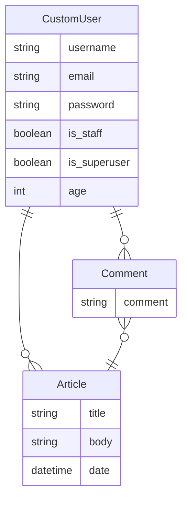

# Django Practice Project: Newspaper Website

## Project Description
This project, developed using Python and the Django framework, aims to
put into practice the concepts learned from the book 'Django for Beginners 4.0'
by William S. Vincent. This website, which serves as an internal tool for a
newspaper, allows journalists to:

* Log In and Log Out.
* Change their account password.
* Write new articles and edit and delete ones of their authorship.
* View and comment on articles written by their colleagues.

This website also allows:

* A Sign-Up process for new journalists.
* Reset forgotten passwords.

With modifications made by me, this project is based on the before-mentioned
book, acting as a functional solution for streamlining the article creation and
editing process within a newspaper organization.

## Stack

### Front-End 
* HTML
* CSS
* Bootstrap (for styling and responsive design)
* Django Template Language (for creating and rendering dynamic views)

### Back-End
* Python
* Django (web framework)
* PostgreSQL (as the database management system)

## Entity Relationship Diagram

NOTE: The 'CustomUser' model inherits Django's built-in 'AbstractUser' model
that haves many other attributes in it. Check the [official documentation](https://docs.djangoproject.com/en/4.1/ref/contrib/auth/)
for more info.